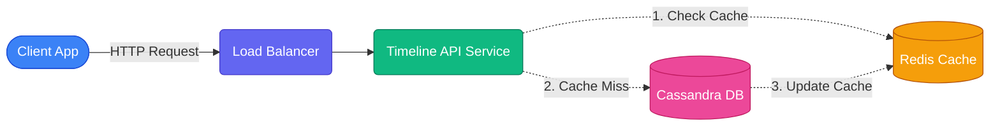

# 5-Step Interview Framework

## Overview
Going into a System Design interview without a strict framework is like building a house without a blueprint. You might have great ideas, but the end result will be a chaotic mess.

This module provides the ultimate **5-Step System Design Framework**. Treat this like a religion. If you follow these 5 steps in order, you will naturally control the pace of the interview, cover all the necessary bases, and demonstrate extreme seniority to your interviewer.

```text
📁 System Design Framework
├── 📄 1. Clarify Requirements (5 min)
│   ├── Functional (Core flows)
│   └── Non-Functional (Scale & Constraints)
├── 📄 2. Back-of-Envelope (5 min)
│   ├── QPS
│   └── Storage & Bandwidth
├── 📄 3. High-Level Design (15 min)
│   └── Component Architecture & Request Tracing
├── 📄 4. Deep Dives (15 min)
│   ├── Schema Design
│   └── Bottleneck Mitigation
└── 📄 5. Trade-offs (5 min)
    └── Identifying System Limits
```

---

## Step 1 — Clarify requirements (5 min)

When the interviewer says, *"Design Twitter"*, your first instinct might be to start drawing boxes. **Stop!** The prompt is intentionally vague. Your first job is to extract the actual requirements.

### Functional Requirements
Ask for the 2-3 Core Flows.
- *Good:* "Should we focus on users posting tweets and viewing their home timeline?"
- *Bad:* "Do we need to support Twitter Blue, direct messages, trending topics, and video uploads?" (You only have 45 minutes, do not increase your own scope!).

### Non-Functional Requirements (Constraints)
Determine the scale and physics of the system.
- "Is this system read-heavy or write-heavy?"
- "What is the expected latency for viewing a timeline?"
- "Are we designing for High Availability (it's okay if a tweet takes 2 seconds to appear) or High Consistency (financial transactions)?"

> [!WARNING]
> **Beginner Mistake:** Do not spend 20 minutes here. Get the core features, agree on them, write them on the board, and move to Step 2.

---

## Step 2 — Back-of-envelope estimates

Now that you know what to build, you must calculate *how big* it needs to be. (See the Capacity Estimation masterclass for the deep dive).

Calculate three numbers:
1. **QPS (Queries Per Second):** How much traffic is hitting the system?
2. **Storage:** How much data are we saving per year?
3. **Bandwidth:** How much data is flowing over the network?

**Why do we do this here?**
Because these numbers dictate your design. If you calculate 100 QPS and 50 GB of storage, you can design a single Postgres database and be done. If you calculate 50,000 QPS and 2 PB of storage, you must immediately start talking about Sharding, Caches, and CDNs.

---

## Step 3 — High-level design (15 min)

This is the core of the interview. You will draw your Level 2 Container Diagram.

**The Golden Rule:** Draw 4 to 8 boxes. No more, no less.



### Trace the Core Request Flow
Do not just draw boxes randomly. Walk the interviewer through the exact path of a request:
1. "The user's request hits our **Load Balancer**."
2. "It gets routed to the **Timeline API Service**."
3. "The Service checks the **Redis Cache** first."
4. "If there's a cache miss, it reads from the **Cassandra Database**."

By speaking out loud while tracing the path, you prove that you understand exactly how the components interact.

---

## Step 4 — Deep dives (15 min)

You have successfully drawn the happy path. Now, the interviewer wants to see how you handle complexity.

### Let the Interviewer Steer
At the end of Step 3, literally ask: *"We have the High-Level Design. Would you like me to deep-dive into the Database Schema, or should we discuss how to eliminate the single points of failure in this architecture?"*

### Common Deep Dive Topics:
- **Schema Design:** Drawing the exact SQL tables or NoSQL JSON blobs.
- **Bottlenecks:** "What happens when Justin Bieber tweets to 100 million followers?" (The Thundering Herd problem).
- **Failure Modes:** "What happens if this datacenter loses power?"

> [!TIP]
> **Teacher's Secret:** A Junior engineer designs a system that works. A Senior engineer designs a system that handles failure gracefully. Focus heavily on what breaks.

---

## Step 5 — Trade-offs (5 min)

There is no "perfect" system design. Every choice you make introduces a weakness.

### Honest about limits = Senior Signal
The best way to end an interview is to critique your own design.
- "We chose to use Cassandra for fast writes. The trade-off is eventual consistency, meaning a user might not see their tweet instantly on another device."
- "What breaks at 10x scale? Our Redis cluster would likely run out of memory, so we would need to implement an LRU eviction policy or shard the cache."

By pointing out the flaws in your own system before the interviewer does, you demonstrate deep maturity and architectural wisdom.
